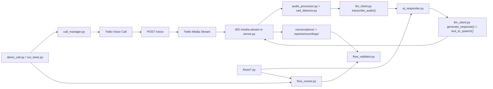

# Phone Call Flow Tester

This repository automates phone-call testing with Twilio Media Streams and OpenAI models. A call is placed through Twilio, the other side is transcribed, a step-guided response is generated, that response is turned into audio, and the final conversation is validated against assertions defined in flow files.

Important: `demo_call.py` and `run_tests.py` place real calls when run.

## What It Does

- Places outbound phone calls through Twilio
- Streams call audio into a FastAPI websocket server
- Detects speech boundaries from incoming audio
- Transcribes the remote side with OpenAI Whisper
- Generates the next reply using a flow-specific system prompt plus step guidance
- Converts the reply to speech and streams it back into the call
- Saves call recordings and structured conversation logs
- Validates the final conversation against per-step assertions

## Architecture



## Core Files

- `run.py`: Starts ngrok, sets `SERVER_URL`, and launches the FastAPI app.
- `run_flow.py`: Runs a single flow by `flow_id` and can optionally clear prior reports first.
- `server.py`: Exposes `/voice` for Twilio webhook traffic and `/media-stream` for the live bidirectional audio loop.
- `call_manager.py`: Wraps the Twilio REST client and creates outbound calls.
- `llm_client.py`: Wraps OpenAI APIs for transcription, chat response generation, and text-to-speech.
- `ai_responder.py`: Holds conversation history and produces the next reply using the selected flow.
- `prompt_builder.py`: Builds the shared system prompt for a live, two-way phone call and appends flow-specific instructions.
- `audio_processor.py`: Converts mulaw to PCM, PCM to mulaw, and resamples TTS output to 8 kHz.
- `vad_detector.py`: Energy-based voice activity detection.
- `conversation_flow.py`: Auto-discovers flow files from `flows/` and builds the flow registry.
- `flow_runner.py`: Runs test flows, waits for completion, loads saved conversation logs, and triggers validation.
- `flow_validator.py`: Applies `step_reached`, `contains`, `not_contains`, and `matches` assertions.
- `flows/*.py`: Each file defines one conversation flow.

## Runtime Flow

1. `demo_call.py` or `run_tests.py` starts a call through `CallManager`.
2. Twilio hits `POST /voice` in `server.py`.
3. The server returns TwiML instructing Twilio to open a websocket media stream.
4. `server.py` receives incoming mulaw audio chunks from the call.
5. Audio is converted to PCM and grouped into speech segments using the VAD logic.
6. Completed speech segments are transcribed with Whisper.
7. `AIResponder` combines the flow system prompt, current step guidance, and conversation history to generate the next reply.
8. The reply is converted to speech, resampled to 8 kHz PCM, converted to mulaw, and streamed back to Twilio.
9. Each turn is stored as a structured conversation exchange.
10. After the timeout, `flow_runner.py` loads the saved conversation and `flow_validator.py` checks the assertions.

## Flow Definitions

Each flow file under `flows/` must define:

- `FLOW`: The flow metadata and step list
- `SYSTEM_PROMPT`: The final prompt used by the AI
- `FLOW_ID`: The identifier used by the flow registry

In practice, flows should build `SYSTEM_PROMPT` from the shared prompt builder and only supply scenario-specific caller facts and extra instructions.

Example:

```python
from prompt_builder import build_system_prompt

FLOW = {
    "name": "Leave Message",
    "phone_number": None,
    "timeout": 180,
    "steps": [
        {
            "step": 1,
            "expect": "greeting or asking how they can help",
            "respond_with": "Say you want to leave a message",
            "example": "I'd like to leave a message please",
            "clinic_assertions": [
                {
                    "type": "contains_any",
                    "value": ["how can i help", "help you today"],
                    "description": "Clinic asked how they can help",
                }
            ],
            "our_assertions": [
                {
                    "type": "contains",
                    "value": "message",
                    "description": "Caller requested to leave a message",
                }
            ],
            "assertions": [
                {"type": "step_reached", "description": "Call connected"},
            ],
        },
    ],
}

CALLER_FACTS = [
    "Name: Alex Kattan",
    "Callback number: 450-233-2096",
]

CUSTOM_INSTRUCTIONS = [
    "Open by saying you want to leave a message.",
]

SYSTEM_PROMPT = build_system_prompt(
    objective="Leave a message with a medical clinic.",
    caller_facts=CALLER_FACTS,
    custom_instructions=CUSTOM_INSTRUCTIONS,
)

FLOW_ID = "leave_message"
```

### Step Fields

- `step`: Step number
- `expect`: What the clinic is expected to say in that exchange
- `respond_with`: Instruction for the AI's reply in that same exchange
- `example`: Example wording for that reply
- `clinic_assertions`: Optional validations against `clinic_said`
- `our_assertions`: Optional validations against `we_said`
- `action`: Optional special action such as `hangup`
- `assertions`: Optional general validations for that exchange, such as `step_reached`

### Assertion Types

- `step_reached`: Passes if the recorded conversation reached that step number
- `contains`: Passes if the targeted text contains the expected value
- `contains_any`: Passes if the targeted text contains at least one expected value
- `not_contains`: Passes if the targeted text does not contain the expected value
- `matches`: Fuzzy keyword check that currently requires about 70% keyword overlap

If you use `clinic_assertions` or `our_assertions`, the target is implied automatically. Flat `assertions` can still be used for exchange-level checks or explicit `target` values.

## Current Flows

The repository currently contains:

- `flows/new_patient_booking_flow.py`
- `flows/book_apt_flow.py`
- `flows/leave_message_flow.py`

`conversation_flow.py` auto-loads every non-underscore Python file in `flows/`.

## Setup

### Requirements

- Python 3.12+
- A Twilio account with a phone number
- An OpenAI API key
- An ngrok account or another public URL for the webhook server

### Installation

```bash
python3 -m venv venv
source venv/bin/activate
pip install -r requirements.txt
```

### Environment Variables

Copy `.env.example` to `.env` and fill in:

```ini
OPENAI_API_KEY=your_openai_api_key
TWILIO_ACCOUNT_SID=your_twilio_account_sid
TWILIO_AUTH_TOKEN=your_twilio_auth_token
TWILIO_PHONE_NUMBER=your_twilio_phone_number
TARGET_PHONE_NUMBER=number_to_call_for_tests
NGROK_AUTHTOKEN=your_ngrok_authtoken
SERVER_URL=
```

Notes:

- `SERVER_URL` is set automatically by `run.py` when ngrok starts.
- `TARGET_PHONE_NUMBER` is the number that will be called by `demo_call.py` and `run_tests.py`.

## Usage

### Safe Inspection Only

This command loads the flow registry without placing any phone calls:

```bash
python3 - <<'PY'
import conversation_flow
print([flow["name"] for flow in conversation_flow.ALL_FLOWS])
print(list(conversation_flow.AVAILABLE_FLOWS.keys()))
PY
```

### Start The Server

```bash
python3 run.py
```

What it does:

- Opens an ngrok tunnel on port `8000`
- Sets `SERVER_URL`
- Starts `uvicorn` with `server:app`

### Place One Test Call

```bash
python3 demo_call.py
```

This uses `TARGET_PHONE_NUMBER` from `.env`.

### Run One Specific Flow

```bash
python3 run_flow.py --list
python3 run_flow.py tampa_faq
python3 run_flow.py tampa_faq --clear-reports
```

Use `--clear-reports` when you want the contents of `reports/` wiped before the next run.

### Run The Whole Test Suite

```bash
python3 run_tests.py
```

This loads every flow from `conversation_flow.py`, places each call, waits for the configured timeout, and exports a summary report.

## Generated Artifacts

During real runs, the application creates:

- `reports/recordings/full_call_<call_sid>_<timestamp>.wav`
- `conversations/conversation_<call_sid>.json`
- `reports/transcript_<flow_name>_<timestamp>.json`
- `reports/calls/<timestamp>_<flow_id>_<call_sid>.html`
- `reports/calls/<timestamp>_<flow_id>_<call_sid>.json`
- `reports/index.html`
- `reports/flow_test_results_<timestamp>.json`

These directories are ignored by Git and can be deleted safely.

## Current Implementation Notes

These details matter when reading or extending the code:

- `run_flow.py` can target a single flow without loading the full registry output, which keeps one-off runs much cleaner.
- `flow_runner.py` now writes per-call HTML and JSON reports and builds a browsable `reports/index.html`.
- The HTML reports use relative links so the entire `reports/` directory can be zipped and shared as a portable bundle.
- `flows/new_patient_booking_flow.py` generates random patient data at import time.
- Assertions are checked against the combined text of both sides of each exchange, not only the AI response.

## Suggested Next Improvements

- Pass the selected `FLOW_ID` from the caller into `server.py` so the live responder and validator use the same flow.
- Use the same selected flow for hangup logic instead of the global default flow.
- End test runs based on call completion rather than sleeping for the full timeout.
- Persist flow metadata alongside each conversation file so validation is tied to the exact runtime flow.
